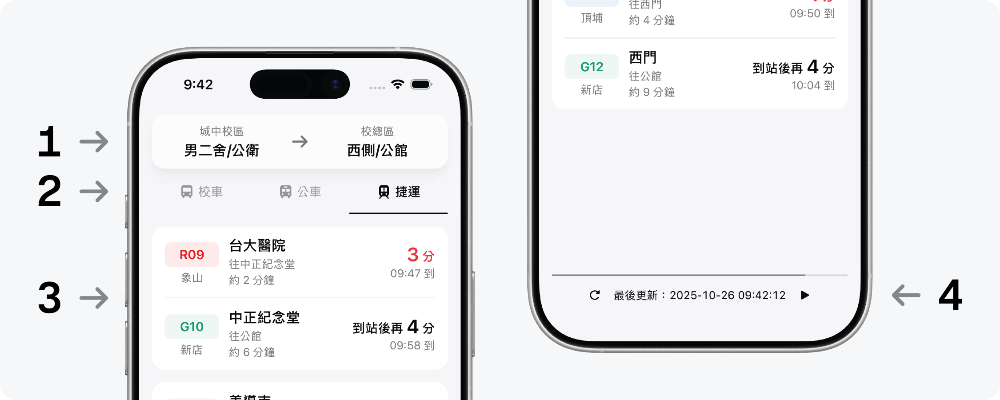

# m2transit

A transport tracker for NTUers travelling between Downtown Campus and Main Campus.


## 🛠 Setup

### Prerequisites

l you have Node.js, npm and Yarn installed.

You will also need to:

- Apply for a TDX account to obtain API credentials
    - Free tier: 5 API calls per minute
    - Paid plan: 5 API calls per second (NT$200/month)

- Set up an Upstash Redis database for caching
    - Alternatively, modify `src/server/lib/cache.ts` to integrate your own caching service

### Environment

After obtaining your credentials, create a local environment file (e.g., `.env.local`) following the format shown in `.env.sample`.

### Commands

```bash
# Development
yarn dev

# Deployment
yarn build
yarn start

# Linting
yarn format
```

The application will launch at [http://localhost:3000](http://localhost:3000) by default.

## ⚙️ Usage



1. **Select route**: Swipe up and down to select the origin and destination.

2. **Choose method**: Pick your preferred transport method.

3. **Check arrivals**: See real-time countdown to the next arrivals.

4. **Data refresh**: Manually refresh data or pause auto-updates.

## 📊 Data Source (and Issues)

### Shuttle Bus

The app uses a timetable based on the official shuttle bus schedule from the [NTU General Affairs Office website](https://ga.ntu.edu.tw/general/main_ch/docDetail/1502/322/348/%20) and automatically calculates the time remaining until the next scheduled departure based on the current time.

### Public Bus

The app connects to the [TDX (Transport Data eXchange) API](https://tdx.transportdata.tw/) to retrieve real-time estimated arrival data.

### Metro

The app also connects to the TDX API for metro data. However, since Taipei Metro does not provide a public real-time arrival API, the following workaround is applied:

- **Heavy-capacity lines**: Similar to the shuttle bus approach, it uses the official train timetable to calculate the next train's arrival time.

- **Wenhu Line**: Wenhu Line operates on dynamic scheduling without fixed timetables. Therefore, the app constructs an estimated timetable using the first/last train times and average headway intervals.

**Known Issues**: Since all displayed arrival times are scheduled or estimated times, which don't reflect real-time conditions at all, the app can't account for service delays, disruptions, or schedule modifications.

## 🚀 Future Enhancements

- **Service day detection**: Add external data sources to accurately identify national holidays, rather than relying solely on weekend detection.

- **Auto updates for shuttle timetable**: Periodically retrieve and parse the latest shuttle bus timetables.

- _and more..._
